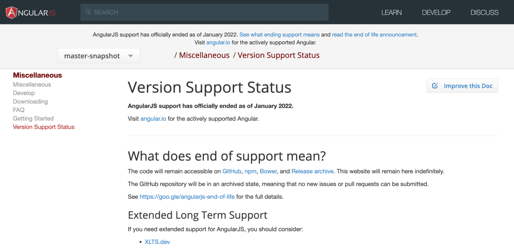

# OpenJS Ecosystem Sustainability Program 

## Summary 

The Ecosystem Sustainability Program is an opt-in OpenJS partner program to help secure outdated software and create new revenue streams for our projects and commercial participants.  

## Benefits

Eligible projects that opt into the program receive revenue that can be used to:

- Grow their community
- Pay contractors
- Support travel
- Cover other project-related expenses

## Current Partners

- [HeroDevs](https://www.herodevs.com/)

## Eligibility

For a project to participate in the program:

- A partner must be providing support to EOL versions of the project
- The project must be willing to place links to the partner on various pages/repositories where EOL versions are mentioned (requirements will vary per partner)
- The project must be willing to manage funds via [Open Collective](https://opencollective.com/).

## How To Participate

Projects that are interested in participating in the program should contact operations@openjsf.org.

## How To Enroll In Open Collective

Because funds are distributed to the project and in most cases not an individual, we suggest creating an *[Open Collective](https://docs.opencollective.com/help/collectives/create-collective)* account and project collective. 

In most cases, projects do not have bank accounts and must [sign up](http://opencollective.com/opensource/apply) with Open Source Collective to be a fiscal host. This means Open Collective will hold the funds on your behalf, handle taxes, and enable you to pay vendors and contractors. 

### Important Information About Payments

- Payments are made to projects every 6 months
- Project payments are excluded from the LF G&A fee
- Open Collective charges a 10% fee on incoming funds if it is used as a fiscal host. The Open Collective [Docs](https://docs.oscollective.org/how-it-works/fees) provide detailed information on fees.

## Partner Specific Guidelines

### HeroDevs

#### Overview

HeroDevs general guidelines for participation are outlined below, these guidelines are flexible and are not intended to be strictly enforced.

HeroDevs can directly assist projects by providing specific recommendations and, upon request, utilizing their resources and staff for design and PR filing.

#### Version Support Page

The project readme and website should clearly indicate which versions of the project are supported and which are not. If you don’t have one already, HeroDevs will be happy to create one for you. Here’s [a great example from the Node.js website](https://nodejs.org/en/about/previous-releases#release-schedule):

#### Referral Links

Project-specific referral links will be provided as part of the onboarding process.

#### Referral Link Placement & Best Practices

The goal of prominently placing referral links is to maximize the likelihood that a user who is stuck on an unsupported version will learn of the existence of alternatives. This might mean that, prior to an EOL milestone or a major version release, one would temporarily have a prominent banner or link.

- Projects should have a prominent Version Support Page
- Referral links to HeroDevs must be placed within the top ⅓ of the page
- The Version Support Page must link to HeroDevs for the versions HeroDevs supports
- When documenting which versions are no longer receiving patches, consider adding a link with copy: “read more about extended support options” that directs to an EOL page.

#### Referral Link Page Examples

